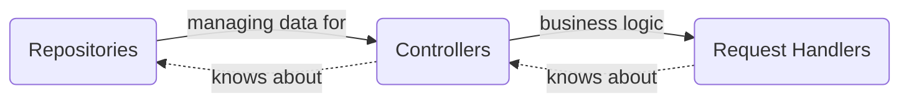

 

# Verni.App.Backend
Server side for Verni App. 

Verni is an open-source shared expenses tracker.
The core value of the App is a focus on testability, extensibility and reliability of the infrastructure it is built with.
Infrastructure refers to both the codebase, the design system and user scenarios.
The main feature of the application is a complete absence of a desire to monetize user journeys. The user's needs should be met in the simplest possible way, forever free.

**Project is under development.**

# Table of Contents
1. [Tech Stack](#TechStack)
2. [Features](#Features)
3. [Architecture Overview](#ArchitectureOverview)
4. [Implementation Overview](#ImplementationOverview)
## [Tech Stack](#TechStack)
- Go
- Gin (HTTP)
- PostgreSQL
- Telegram (watchdog alerts)
- JWT (auth)
## [Features](#Features)
- tbd
## [Architecture Overview](#ArchitectureOverview)
The App's architecture can be considered as a set of _Layers_. Each layer knows only about the layer "below".

Each part of domain or data layer has its own *abstract* module containing a set of interfaces/entities and at least one *implementation* module. If necessary, implementation modules can be dependent on the [Services Layer](#ServicesLayer).

No *abstract* module depends on any *implementation* module, which is strictly prohibited to ensure proper encapsulation. It can guarantee that touching implementations will not trigger recompilation of other implementation modules, only that of the final target, which in most cases can leverage incremental compilation. It is highly recommended to keep *abstract* modules without any dependencies to provide better testability.

## [Implementation Overview](#ImplementationOverview)
### [Services Layer](#ServicesLayer)
Service is an abstraction over some 3rdparty library (like JWT or some hashing algorithms) or some real-world event (SMTP, logging, databases etc.) to ensure the possibility to mock or replace them.

---

- `watchdog` - interface for sending alerts as files or messages. Production watchdog is sending notifications to telegram channel.
- `logging` - logging interface with severity support. Production logger is sending notifications to `watchdog` service when called with `error` severity level attaching last 1000 sent messages.
- `db` - interface which `database/sql` functions conform with. Production watchdog is a `PostgreSQL` driver.
- `emailSender` - interface for sending email messages. Production sender is a Yandex SMTP service.
- `formatValidation` - interface for various data types format validation, like display names, emails, passwords. If necessary, it can be split into a set of separate interfaces for each data type.
- `realtimeEvents` - service for realtime user notifications. Gin-based HTTP long-polling in production.
- `jwt` - Json Web Tokens standart interface. Using a wrapper around 3rdparty library in production.
- `pathProvider` - interface for getting absolute paths from relative independently from location of the binary file. Using value from environment in production.
- `pushNotifications` - interface for sending push notifications. APNS is supported in production.
### Repositories Layer
Repository is an abstraction over some data storage. Each repository should provide an access to certain problem domain. Each mutable (update/delete/insert) action should return an instance of "transaction" object which can rollback performed action.
### Controllers Layer
Controller is responsible to do data manipulations to perform some product use case. Usually controller is a coordinator of several repositories. Example: to get a "Profile Info" info you have to query both `auth` and `users` repository to get private(eg email or verification status) and public(display name or avatar) account data.
### Request Handlers Layer
The topmost layer. Each request handler provides an action to be performed when the corresponding URL is called. In most cases Request Handler is a decorator over some Controller that interacts with notification services (push, polling etc) and maps Controllers entities into serializable ones
