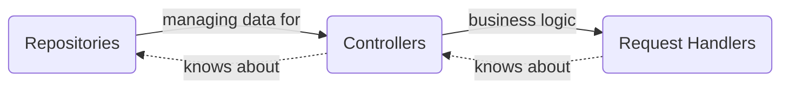

# Verni.App.Backend
Server side for Verni App
# Table of Contents
1. [Tech Stack](#Tech Stack)
2. [Features](#Features)
3. [Architecture/Implementation Overview](#Architecture/Implementation Overview)
## Tech Stack
- Go
- Gin (HTTP)
- PostgreSQL
- Telegram (watchdog alerts)
- JWT (auth)
## Features 
- tbd
## Architecture/Implementation Overview
The App's architecture can be considered as a set of _Layers_. Each layer knows only about the layer "below".

Each part of domain or data layer has its own *abstract* module containing a set of interfaces/entities and at least one *implementation* module. If necessary, implementation modules can be dependent on the *service* layer. Service is an abstraction over some 3rdparty library (like JWT or some hashing algorithms) or some real-world event (SMTP, logging, databases etc.) to ensure the possibility to mock or replace them.

No *abstract* module depends on any *implementation* module, which is strictly prohibited to ensure proper encapsulation. It can guarantee that touching implementations will not trigger recompilation of other implementation modules, only that of the final target, which in most cases can leverage incremental compilation. It is highly recommended to keep *abstract* modules without any dependencies to provide better testability.
